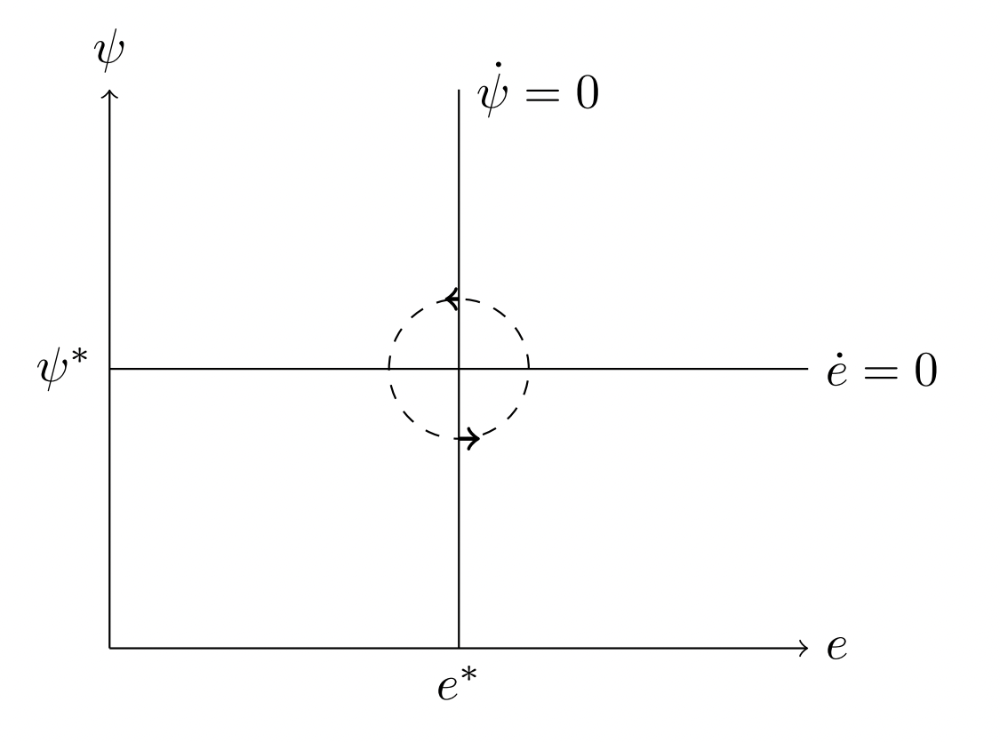

```{r Setup, include = F}
options(htmltools.dir.version = FALSE)
library(pacman)
p_load(broom, latex2exp, ggplot2, ggthemes, ggforce, viridis, dplyr, magrittr, knitr, parallel, xaringanExtra,
       tidyverse, sjPlot, extrafont, mathjaxr, ggforce, furrr, kable, kableExtra,
       fontawesome, ggthemr, hrbrthemes)


# Knitr options
opts_chunk$set(
  comment = "#>",
  fig.align = "center",
  fig.height = 7,
  fig.width = 10.5,
  warning = F,
  message = F,
  dpi=300
)


```

```{R, colors, include = F}
# Define pink color
red_pink <- "#e64173"
turquoise <- "#20B2AA"
orange <- "#FFA500"
red <- "#E02C05"
blue <- "#2b59c3"
green <- "#0FDA6D"
grey_light <- "grey70"
grey_mid <- "grey50"
grey_dark <- "grey20"
purple <- "#6A5ACD"
met_slate <- "#23373b" 
```


```{r, echo=FALSE}
knitr::read_chunk('script_research.R')

```


```{r, echo=FALSE}
<<load_packages>>

```

```{r, echo=FALSE}
<<ham>>

```

```{r, echo=FALSE}
<<set>>

```


class: middle, center, inverse


.b[Marcio Santetti]


.b[Ph.D. Candidate]

.b[University of Utah]


[`r fontawesome::fa("envelope")` santetti@gmail.com](mailto:santetti@gmail.com) <br>
[`r fontawesome::fa("link")` marcio.rbind.io](https://marcio.rbind.io) <br>
[`r fontawesome::fa("github")` github.com/marciosantetti](https://github.com/marciosantetti) 

---

# Presentation outline

<br>

1. Overview/Motivation

2. Theoretical premises

3. Data sources and issues

4. Applied methodology/Results

5. Final remarks

---
layout: false
class: inverse, middle

# Overview

---


# Motivation

.pull-left[

A model of the .hi[growth/distributive] cycle:

  - A never-ending .hi-red[conflict]/.hi[symbiosis] between capital and labor
    - [`Goodwin (1967)`](https://link.springer.com/chapter/10.1007/978-1-349-05504-3_12)


]


--

.pull-right[

<br><br><br>

Key .hi[missing points]:

  - .hi-slate[*What*] drives the cycle?
  
  - .hi-slate[*Who*] drives the cycle?
  
  - How does the .hi-slate[Goodwin pattern] behave when including these features?

]


---
layout: false
class: inverse, middle

# Theoretical premises

---

# Theoretical premises

.pull-left[

Starting point:

- A model in capacity utilization (*u*), aggregate investment/accumulation (*g*), employment (*e*), and the labor share of income (*&psi;*).


.it[Novelty]: incorporating .hi[aggregate and disaggregated investment] into empirical post-Keynesian/neo-Goodwinian models.

  - Residential investment: *household*- or *corporate*-led?

]

--

.pull-right[

<br>

A four-variable stylized model on their .hi[contemporaneous] linkages:

<br>

$$
\begin{align}
u_t &= u(u_t, g_t, \psi_t) \tag{1} \\
g_t &= g(g_t, u_t, \psi_t) \tag{2} \\
e_t &= e(e_t, u_t) \tag{3} \\
\psi_t &= \psi(\psi_t, e_t) \tag{4}
\end{align}
$$

]


---

# Theoretical premises

<br>

$$
\begin{align}
u_t &= u(u_t, g_t, \psi_t) \tag{1} \\
g_t &= g(g_t, u_t, \psi_t) \tag{2} \\
e_t &= e(e_t, u_t) \tag{3} \\
\psi_t &= \psi(\psi_t, e_t) \tag{4}
\end{align}
$$

(1): The distributive variable contemporaneously affects the activity one, but not vice-versa. If $u_{\psi}<0$, demand is .hi[profit-led].

--

(2): .hi[Cross-feedback] between investment and capacity utilization. Since investment is determined by profit rate expectations, it also depends on income distribution.

--

(3): Labor market as a product of the .hi[state] of the business cycle.

--

(4): A .hi[Phillips curve], relating distribution and the state of the labor market. If $\psi_e > 0$, distribution follows a .hi[profit-squeeze] profile.

---

layout: false
class: inverse, middle

# Data sources and issues


---

# Data sources and issues

* .hi[Sample period]: 1949Q1&#8212;2020Q4

--

* .hi[Variables]:

  * Real output (*u*, *proxy* for capacity utilization) and
  * Aggregate (*g*), residential (*g*<sup>*R*</sup>), and nonresidential (*g*<sup>*N*</sup>) investment;
  
      * NIPA Table 1.1.3, 2012=100.
      * FRED series *GDPC1* and *GPDIC1* for robustness checks.
    
  * Employment rate (*e*): remainder to 1 from FRED's *UNRATE* series;
  
  * Labor share (*&psi;*): BLS's “headline measure,” non-farm business sector.
  
--
  
* .hi[Trend-cycle decomposition method]:

  - Hamilton filter.


---

# The Hamilton filter in action


```{r, dev = "svg", echo = F, fig.height = 6.5, fig.width=13}
<<hamfig>>

```

---

# Data sources and issues

.hi[Key] theoretical prior in the business cycle literature:

  - Residential investment as

    - (*a*) a *household*-led and  
    - (*b*) an *autonomous* expenditure.
  
--

<br>

The interpretation that the business cycle is *consumption*, *wage*, or at least *household-led* follows directly therefrom.

--

However, both (*a*) and (*b*) are likely .hi[incorrect priors].

--

<br>

Let us start with (*a*).

---

# Data sources and issues

*Household-led* residential investment?

> .note["**Residential structures consists of new construction of permanent-site single family and multifamily housing units**, improvements (additions, alterations, and major structural replacements) to housing units, expenditures on manufactured homes, brokers’ commissions and other ownership transfer costs on the sale of residential property, and net purchases of used structures from government agencies. Residential structures **also includes some types of equipment (such as heating and air conditioning equipment) that are built into the structure**. Residential equipment consists of equipment, such as furniture or household appliances, that is purchased by landlords for rental to tenants."]

.right[(*BEA, Concepts and Methods of the U.S. National Income and Product Accounts, chapter 6*)]

--


The official description .hi[does not] attribute the construction of new housing units to households.

--

In fact, reality *discredits* such view.

---

# Data sources and issues

Residential construction may be broken down into .hi[four] main segments:

  - (*i*) new subdivisions of single-family homes;
  - (*ii*) new multifamily buildings;
  - (*iii*) isolated single-family owner-occupied homes built on commission by the owner;
  - (*iv*) remodeling of existing owner-occupied properties.
  
--

(*i*) and (*ii*) involve the largest money volumes, and are .hi[led by corporations].

--

(*iii*) and (*iv*) are mainly .hi[led by households], but new construction planned and executed by households accounts for "less than 5% of the total volume in this segment."

--

Thus, only *remodeling* is majorly household-led. 

--

Overall, only about .hi[1/3] of total residential investment is undertaken by households.


---

# Data sources and issues

Now, regarding the .hi["autonomous"] character of household-led residential investment...

--

- Highly sensitive to .hi[financial] conditions (mortgage and rental rates) 

  - [`Jud and Winkler (2002)`](https://ideas.repec.org/a/jre/issued/v23n1-22002p29-46.html)

- Highly dependent on .hi[population]/.hi[labor] force growth rates 

  - [`Zabel (2012)`](https://www.sciencedirect.com/science/article/pii/S0094119012000381)
  - [`Harvard University's Joint Center For Housing Studies (2021)`](https://www.jchs.harvard.edu/improving-americas-housing-2021)
  
- Remodeling (improvement and repair) expenditures are highly correlated with .hi[economic activity] indicators
  
  - Own-sector and current income factors.
  

--

$\therefore$ Household-led residential investment is .hi[not] autonomous.


---

layout: false
class: inverse, middle

# Applied methodology


---

# Applied methodology

### A four-variable system

.pull-left[

.hi[SVAR] representation:

$$
\begin{aligned}
\mathbf{A} \mathbf{\nu_t} = \mathbf{\alpha} + \sum_{i=1}^{l} \mathbf{A_{i}} \mathbf{\nu_{t-i}} + \mathbf{B} \mathbf{\varepsilon_{t}}
\end{aligned}
$$

where $\mathbf{\nu_t} = (u_t, g_t, e_t, \psi_t)'$ is a row vector containing the endogenous variables.


The key estimates are contained in  $\mathbf{\varepsilon_{t}}$, the vector of structural shocks (residuals).


But these are *not directly observable*, requiring the estimation of a reduced-form VAR model.
]

--

.pull-right[

A .hi[reduced-form VAR] representation:

$$
\begin{aligned}
\mathbf{\nu_t} = \mathbf{\gamma} + \sum_{i=1}^{l} \mathbf{C_{i}} \mathbf{\nu_{t-i}} + e_{t}
\end{aligned}
$$
where $\mathbf{e_{t}} = \mathbf{A^{-1} B}\mathbf{\varepsilon_{t}}$ is a vector of mutually correlated reduced-form residuals.

]

---

# Applied methodology

### A four-variable system


$$
\begin{split}
\mathbf{A}{e_{t}} = \mathbf{B}{\varepsilon_{t}} =  
\left[ \begin{array}{cccc}
1 & a_{12} & a_{13} & a_{14} \\
a_{21} & 1 & a_{23} & a_{24} \\
a_{31} & a_{32} & 1 & a_{34} \\
a_{41} & a_{42} & a_{43} & 1 \end{array} \right]
\left[ \begin{array}{c}
e_t^{u} \\
e_t^{g} \\
e_t^{e} \\
e_t^{\psi} \end{array} \right]
&=
\mathbf{B} 
\left[ \begin{array}{c}
\varepsilon_t^{\text{demand shock}} \\
\varepsilon_t^{\text{investment shock}} \\
\varepsilon_t^{\text{employment shock}} \\
\varepsilon_t^{\text{wage share shock}} \end{array} \right]
\end{split}
$$

--

For an exact system identification, one needs *n(n-1)/2 = 6* restrictions (i.e., zero entries). So, the **A** matrix becomes

.pull-left[
$$
\begin{align}
u_t &= u(u_t, g_t, \psi_t)  \\
g_t &= g(g_t, u_t, \psi_t)  \\
e_t &= e(e_t, u_t)  \\
\psi_t &= \psi(\psi_t, e_t) 
\end{align}
$$
]

.pull-right[

$$
\begin{split}
\mathbf{A} =  
\left[ \begin{array}{cccc}
1 & a_{12} &  0 & a_{14} \\
a_{21} & 1 & 0 & a_{24} \\
a_{31} & 0 & 1 & 0 \\
0 & 0 & a_{43} & 1 \end{array} \right]
\end{split}
$$
]

---

# Applied methodology

<br><br>

.center[

$$
\begin{split}
\mathbf{A} =  
\left[ \begin{array}{cccc}
1 & \color{red}{a_{12}} &  0 & a_{14} \\
\color{red}{a_{21}} & 1 & 0 & a_{24} \\
a_{31} & 0 & 1 & 0 \\
0 & 0 & a_{43} & 1 \end{array} \right]
\end{split}
$$

]

<br>

*a*<sub>12</sub> and *a*<sub>21</sub>: .hi[investment-capacity utilization] dynamics.

---

# Applied methodology

<br><br>

.center[

$$
\begin{split}
\mathbf{A} =  
\left[ \begin{array}{cccc}
1 & a_{12} &  0 & a_{14} \\
a_{21} & 1 & 0 & a_{24} \\
\color{red}{a_{31}} & 0 & 1 & 0 \\
0 & 0 & a_{43} & 1 \end{array} \right]
\end{split}
$$

]

<br>

*a*<sub>31</sub>: .hi[labor market] dynamics.

---

# Applied methodology

<br><br>

.center[

$$
\begin{split}
\mathbf{A} =  
\left[ \begin{array}{cccc}
1 & a_{12} &  0 & a_{14} \\
a_{21} & 1 & 0 & a_{24} \\
a_{31} & 0 & 1 & 0 \\
0 & 0 & \color{red}{a_{43}} & 1 \end{array} \right]
\end{split}
$$

]

<br>

*a*<sub>43</sub>: the .hi[profit-squeeze] hypothesis.

---

# Applied methodology

<br><br>

.center[

$$
\begin{split}
\mathbf{A} =  
\left[ \begin{array}{cccc}
1 & a_{12} &  0 & \color{red}{a_{14}} \\
a_{21} & 1 & 0 & \color{red}{a_{24}} \\
a_{31} & 0 & 1 & 0 \\
0 & 0 & a_{43} & 1 \end{array} \right]
\end{split}
$$

]

<br>

*a*<sub>14</sub> and *a*<sub>24</sub>: the .hi[distributive effects] on investment and capacity utilization.

---
layout: false
class: inverse, middle

# Results: 4-variable system

---

# Results


.pull-left[

### Housekeeping


Lag lengths (order):
  
  - 4-variable system: .hi[4] lags;
  - 5-variable system: .hi[10] lags.


These lag orders guarantee .hi[well-specified] models:

  - No *serial correlation* and
  - No *heteroskedasticity.* 

]

--

.pull-right[

### Visualization strategy


The key results are captured by .hi[impulse-response functions] (IRFs).


In addition, .hi[cyclical interactions] extracted from IRFs

  - [`Nikiforos et al. (2021)`](https://papers.ssrn.com/sol3/papers.cfm?abstract_id=3917005).

]

---

# Results

```{r, echo=FALSE}
<<irf1>>

```

```{r, echo=FALSE}
<<cycles1>>

```

Extracting cyclical trajectories from Impulse-Response Functions:


.pull-left[

```{r, dev = "svg", echo = F, fig.height = 2.5, fig.width=2.5}
<<demo1>>

```

]


--

.pull-right[

```{r, dev = "svg", echo = F, fig.height = 2.5, fig.width=2.5}
<<demo2>>

```

]

--

.center[

```{r, dev = "svg", echo = F, fig.height = 2.3, fig.width=4.5}
<<demo3>>

```

]


---


# Results: 4-variable system

*(u,g)* plane:

```{r,dev = "svg", echo = F, fig.height = 5, fig.width=10}
<<fig1>>

```

---


# Results: 4-variable system

*(u,g)* plane:

.pull-left[
```{r, dev = "svg", echo = F, fig.height = 5, fig.width=7}
<<fig1_1>>

```
]

.pull-right[

<br><br>

- .hi[Clockwise] cycle
- Investment .hi[leading] capacity utilization.
]


---


# Results: 4-variable system

```{r, echo=FALSE}
<<irf2>>

```

```{r, echo=FALSE}
<<cycles2>>

```


*(u,&psi;)* plane:


```{r, dev = "svg", echo = F, fig.height = 5, fig.width=10}
<<fig2>>

```


---


# Results: 4-variable system

*(u,&psi;)* plane:

.pull-left[
```{r, dev = "svg", echo = F, fig.height = 5, fig.width=7}
<<fig2_1>>

```
]

.pull-right[

<br><br>

- .hi[Counter-clockwise] cycle
- .hi[Profit-led] demand/.hi[Profit-squeeze] distribution
]


---


# Results: 4-variable system

```{r, echo=FALSE}
<<irf3>>

```

```{r, echo=FALSE}
<<cycles3>>

```

*(e,&psi;)* plane:


```{r, dev = "svg", echo = F, fig.height = 5, fig.width=10}
<<fig3>>

```


---


# Results: 4-variable system

*(e,&psi;)* plane:

.pull-left[
```{r, dev = "svg", echo = F, fig.height = 5, fig.width=7}
<<fig3_1>>

```
]

.pull-right[
<br><br>

- .hi[Counter-clockwise] cycle
- .hi[Profit-led] demand/.hi[Profit-squeeze] distribution
]


---

layout: false
class: inverse, middle

# Results: 5-variable system


---

# Applied methodology

### A five-variable system

Aggregate investment is .hi[replaced] by its residential (*g*<sup>*R*</sup>) and nonresidential (*g*<sup>*N*</sup>) components.

--

<br>

.pull-left[

A five-variable model:

$$
\begin{align}
g_t^R &= g^R(g_t^R, g_t^N, \psi_t)   \\
g_t^N &= g^N(g_t^N, u_t, e_t)  \\
u_t &= u(u_t, g_t^R, \psi_t)  \\ 
e_t &= e(e_t, g_t^R, u_t)  \\
\psi_t &= \psi(\psi_t, g_t^N, e_t) 
\end{align}
$$
]

.pull-right[

The **A** matrix becomes

$$
\begin{split}
\mathbf{A} =  
\left[ \begin{array}{ccccc}
1 & a_{12} & 0 & 0 & a_{15}\\
0 & 1 & a_{23} & a_{24} & 0\\
a_{31} & 0 & 1 & 0 & a_{35}\\
a_{41} & 0 & a_{43} & 1 & 0 \\
0 & a_{52} & 0 & a_{54} & 1 \end{array} \right]
\end{split}
$$
]

---

# Results: 5-variable system

```{r, echo=FALSE}
<<set_2>>

```

```{r, echo=FALSE}
<<irf_5>>

```

```{r, echo=FALSE}
<<cycles_5>>

```

```{r, echo=FALSE}
<<irf_6>>

```

```{r, echo=FALSE}
<<cycles_6>>

```

```{r, echo=FALSE}
<<irf_7>>

```

```{r, echo=FALSE}
<<cycles_7>>

```


```{r, echo=FALSE}
<<irf_8>>

```

```{r, echo=FALSE}
<<cycles_8>>

```

```{r, echo=FALSE}
<<irf_9>>

```

```{r, echo=FALSE}
<<cycles_9>>

```


*(u,&psi;)* plane:


```{r, dev = "svg", echo = F, fig.height = 4, fig.width=8}
<<fig5_1>>

```


.hi[Counter-clockwise] cycle & .hi[Profit-led] demand/.hi[Profit-squeeze] distribution.

---

# Results: 5-variable system

*(e,&psi;)* plane:


```{r, dev = "svg", echo = F, fig.height = 4, fig.width=8}
<<fig6_1>>

```


.hi[Counter-clockwise] cycle & .hi[Profit-led] demand/.hi[Profit-squeeze] distribution.


---


# Results: 5-variable system

*(u,g<sup>R</sup>)* plane:


```{r, dev = "svg", echo = F, fig.height = 4, fig.width=8}
<<fig8_1>>

```


.hi[Clockwise] cycle & Residential investment .hi[leading] capacity utilization.


---

# Results: 5-variable system

*(u,g<sup>N</sup>)* plane:


```{r, dev = "svg", echo = F, fig.height = 4, fig.width=8}
<<fig9_1>>

```

.hi[Counter-clockwise] cycle &
Nonresidential investment .hi[lagging] capacity utilization.


---

layout: false
class: inverse, middle

# Final remarks


---

# Final remarks

<br><br><br>

- Results from both four- and five-variable models conform to the .hi["cyclical stylized facts."]


--

- The paper verifies the .hi[leading role] played by (residential) investment for the business cycle.

--

- Residential expenditures are .hi[neither] household-led nor autonomous.

--

- A first attempt to .hi[connect] residential investment with the Goodwin pattern.

---

layout: false
class: inverse, middle

# .b[Thank you!]


---
exclude: true
